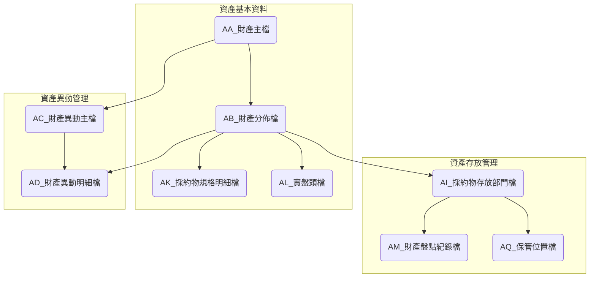
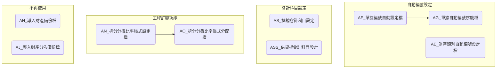

# ARTHAS 固定資產系統資料表總覽

## 系統介紹

ARTHAS固定資產系統是一個專門管理企業固定資產的系統，主要負責處理資產登記、折舊計算、資產異動與盤點等相關業務，包括財產主檔管理、資產異動追蹤、資產位置管理、折舊分攤等功能。系統包含多個資料表來記錄資產基本資訊、異動歷程及相關管理資料。

## 資料表列表

| No. | 資料表代碼       | 中文名稱               | 主要功能                          |
| --- | ---------------- | ---------------------- | --------------------------------- |
| 1   | [AA](ARTHAS/AA.md)    | 財產主檔               | 記錄資產基本資料                  |
| 2   | [AB](ARTHAS/AB.md)    | 財產分佈檔             | 記錄資產分佈資訊                  |
| 3   | [AC](ARTHAS/AC.md)    | 財產異動主檔           | 管理資產異動主要資訊              |
| 4   | [AD](ARTHAS/AD.md)    | 財產異動明細檔         | 記錄資產異動詳細內容              |
| 5   | [AE](ARTHAS/AE.md)    | 財產類別自動編號設定檔 | 設定財產類別編號規則              |
| 6   | [AF](ARTHAS/AF.md)    | 單據編號自動設定檔     | 管理單據編號自動設定              |
| 7   | [AG](ARTHAS/AG.md)    | 單據自動編號序號檔     | 記錄單據編號序列                  |
| 8   | [AH](ARTHAS/AH.md)    | 導入財產備份檔         | 備份導入的財產資料(不再使用)      |
| 9   | [AI](ARTHAS/AI.md)    | 採約物存放部門檔       | 管理資產存放部門資訊              |
| 10  | [AJ](ARTHAS/AJ.md)    | 導入財產分佈備份檔     | 備份導入的財產分佈資料(不再使用)  |
| 11  | [AK](ARTHAS/AK.md)    | 採約物規格明細檔       | 記錄資產規格詳細資料              |
| 12  | [AL](ARTHAS/AL.md)    | 實盤頭檔               | 管理資產盤點作業主檔              |
| 13  | [AM](ARTHAS/AM.md)    | 財產盤點紀錄檔         | 記錄資產盤點結果                  |
| 14  | [AN](ARTHAS/AN.md)    | 拆分分攤比率帳式設定檔 | 設定折舊分攤比率格式(工程訂製)    |
| 15  | [AO](ARTHAS/AO.md)    | 拆分分攤比率帳式分配檔 | 管理折舊分攤比率分配(工程訂製)    |
| 16  | [AQ](ARTHAS/AQ.md)    | 保管位置檔             | 管理資產存放位置資訊              |
| 17  | [AS](ARTHAS/AS.md)    | 抵銷會計科目設定       | 設定資產與會計科目對應關係        |
| 18  | [ASS](ARTHAS/ASS.md) | 借貸提會計科目設定     | 設定會計科目借貸提關係(IFRSASP02) |

## 資料表關聯圖

### 主要業務關聯圖

以下關聯圖顯示系統主要業務資料表間的關聯關係：

### 系統配置類資料表圖

以下關聯圖顯示系統配置類及獨立資料表：

## 系統架構

### 模組結構

ARTHAS系統由以下主要功能模組組成：

#### 1. 資產基本資料管理模組

主要負責固定資產基本資料的維護與管理。

- 核心表格：AA(財產主檔)、AB(財產分佈檔)、AK(採約物規格明細檔)
- 主要功能：
  - 資產基本資料維護
  - 資產分類管理
  - 資產規格管理
  - 資產存放位置管理
- 業務流程：
  - 資產登記流程：基本資料輸入→規格設定→位置設定→相關圖片上傳→資產啟用
  - 資產資料修改流程：查詢資產→修改資料→記錄異動→更新資產資訊

#### 2. 資產異動管理模組

主要負責資產異動記錄的管理。

- 核心表格：AC(財產異動主檔)、AD(財產異動明細檔)
- 主要功能：
  - 資產異動記錄
  - 資產移轉管理
  - 資產報廢管理
  - 異動單據管理
- 業務流程：
  - 資產異動流程：選擇異動類型→填寫異動資訊→生成異動單→核准異動→更新資產狀態
  - 資產報廢流程：填寫報廢申請→核准報廢→資產報廢處理→更新資產狀態

#### 3. 資產存放管理模組

主要負責資產存放位置與部門的管理。

- 核心表格：AI(採約物存放部門檔)、AQ(保管位置檔)
- 主要功能：
  - 資產存放部門設定
  - 保管位置管理
  - 資產位置追蹤
  - 存放位置報表
- 業務流程：
  - 資產存放設定流程：新增存放部門→設定保管位置→關聯至資產分佈→更新存放資訊

#### 4. 資產盤點管理模組

主要負責資產盤點作業的管理。

- 核心表格：AL(實盤頭檔)、AM(財產盤點紀錄檔)
- 主要功能：
  - 盤點作業管理
  - 盤點差異分析
  - 盤點記錄追蹤
  - 盤點報表產生
- 業務流程：
  - 盤點作業流程：準備盤點清冊→執行盤點→記錄盤點結果→差異分析→資產資料更新
  - 盤點差異處理流程：盤點差異確認→差異原因調查→提出處理方案→核准處理→資產調整

#### 5. 系統配置管理模組

主要負責系統各項參數和編號規則的設定。

- 核心表格：AE(財產類別自動編號設定檔)、AF(單據編號自動設定檔)、AG(單據自動編號序號檔)
- 主要功能：
  - 財產類別編號設定
  - 單據編號規則管理
  - 序號維護
- 業務流程：
  - 編號規則設定流程：分析編號需求→設定編號規則→測試編號產生→啟用編號規則

#### 6. 會計整合模組

主要負責固定資產與會計系統的整合。

- 核心表格：AS(抵銷會計科目設定)、ASS(借貸提會計科目設定)、AN(拆分分攤比率帳式設定檔)、AO(拆分分攤比率帳式分配檔)
- 主要功能：
  - 會計科目對應設定
  - 折舊分攤管理
  - 會計資料整合
- 業務流程：
  - 會計設定流程：設定會計科目→設定折舊分攤參數→檢核會計對應→產生會計資料

### 模組關聯與資料表關聯說明

#### 模組間主要關聯

- **資產基本資料管理與資產異動管理**：財產主檔(AA)與財產異動主檔(AC)互相關聯，異動會更新資產資料
- **資產基本資料管理與存放管理**：財產分佈檔(AB)關聯至採約物存放部門檔(AI)，記錄資產存放資訊
- **存放管理與盤點管理**：採約物存放部門檔(AI)關聯至財產盤點紀錄檔(AM)，提供盤點的位置依據
- **系統配置管理與基本資料管理**：自動編號設定(AE)提供資產編號的規則，用於新增資產時使用
- **會計整合模組與資產基本管理**：資產資料變更時需同步更新會計相關資訊

#### 重要表格間關聯

1. **AA(財產主檔)與AB(財產分佈檔)的關聯**

   - **關聯欄位**:
     - AA.財產編號 → AB.財產編號
   - **業務關係**:
     - 記錄資產在不同部門或地點的分佈情況
     - 一筆資產可能有多筆分佈記錄
2. **AB(財產分佈檔)與AI(採約物存放部門檔)的關聯**

   - **關聯欄位**:
     - AB.存放部門 → AI.部門代碼
   - **業務關係**:
     - 記錄資產存放的具體部門資訊
     - 為盤點和資產追蹤提供位置數據
3. **AI(採約物存放部門檔)與AQ(保管位置檔)的關聯**

   - **關聯欄位**:
     - AI.位置代碼 → AQ.位置代碼
   - **業務關係**:
     - 提供資產存放的詳細位置資訊
     - 協助進行資產定位和管理
4. **AN(拆分分攤比率帳式設定檔)與AO(拆分分攤比率帳式分配檔)的關聯**

   - **關聯欄位**:
     - AN.帳式代碼 → AO.帳式代碼
   - **業務關係**:
     - 定義折舊分攤的計算方式
     - 工程訂製功能，用於特定的折舊計算需求

#### 資料流動路徑

1. **資產登記資料流**：

   - AA(財產主檔) → AB(財產分佈檔) → AI(採約物存放部門檔) → AQ(保管位置檔)
2. **資產盤點資料流**：

   - AB(財產分佈檔) → AI(採約物存放部門檔) → AM(財產盤點紀錄檔)
3. **資產異動資料流**：

   - AC(財產異動主檔) → AD(財產異動明細檔) → 更新AA(財產主檔)
4. **會計整合資料流**：

   - AA(財產主檔) → AN/AO(拆分分攤設定) → AS/ASS(會計科目設定) → 產生會計分錄

## 版本歷史記錄

| 版本 | 日期       | 修改人     | 變更描述                                             |
| ---- | ---------- | ---------- | ---------------------------------------------------- |
| 1.0  | 2023-11-15 | 系統管理員 | 初始版本建立                                         |
| 1.1  | 2024-07-06 | 系統管理員 | 更新資料表關聯圖及修正表格名稱                       |
| 1.2  | 2024-07-07 | 系統管理員 | 將關聯圖分為主要業務與系統配置兩部分，優化圖表清晰度 |
