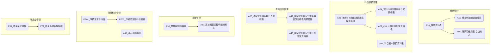

# ARTHGL 總帳系統資料表總覽

## 系統介紹

ARTHGL 總帳系統是一個財務會計管理系統，主要負責處理企業會計記帳、傳票管理、科目餘額維護等相關業務，包括傳票製作、會計科目異動管理、預算控制、票據管理等功能。系統包含多個資料表來記錄傳票資料、科目餘額及相關財務資訊。

## 資料表列表

| No. | 資料表代碼       | 中文名稱                                 | 主要功能                       |
| --- | ---------------- | ---------------------------------------- | ------------------------------ |
| 1   | [A24](ARTHGL/A24.md)    | 傳票(製票)資料表                         | 記錄傳票基本資料               |
| 2   | [A25](<ARTHGL/(暫停使用)A25.md>) | 應收帳款明細資料表                       | 管理應收帳款資訊(暫停使用)     |
| 3   | [A26](<ARTHGL/(暫停使用)A26.md>) | 應付帳款明細資料表                       | 管理應付帳款資訊(暫停使用)     |
| 4   | [A29](ARTHGL/A29.md)    | 科目分攤比例設定資料表                   | 設定科目分攤比例               |
| 5   | [A32](<ARTHGL/(暫停使用)A32.md>) | 科目對沖餘額資料表                       | 記錄科目對沖餘額(暫停使用)     |
| 6   | [A33](ARTHGL/A33.md)    | 會計科目每日異動總表與預算檔             | 記錄科目每日異動與預算資訊     |
| 7   | [A34](ARTHGL/A34.md)    | 會計科目(分攤後)每日異動總表             | 記錄分攤後科目每日異動         |
| 8   | [A35](ARTHGL/A35.md)    | 專案會計科目每日異動總表                 | 記錄專案科目每日異動           |
| 9   | [A36](ARTHGL/A36.md)    | 票據明細資料表                           | 管理票據明細資訊               |
| 10  | [A37](ARTHGL/A37.md)    | 票據異動記錄明細資料表                   | 記錄票據異動情況               |
| 11  | [A42](ARTHGL/A42.md)    | 專案會計科目(分攤後)每日異動總表與預算檔 | 管理專案科目分攤後異動及預算   |
| 12  | [A43](ARTHGL/A43.md)    | 專案會計科目分攤比例設定資料表           | 設定專案科目分攤比例(暫停使用) |
| 13  | [A48](ARTHGL/A48.md)    | 產品沖銷明細                             | 記錄產品沖銷資訊               |
| 14  | [A50](ARTHGL/A50.md)    | 傳票明細摘要異動表                       | 記錄傳票摘要異動資訊           |
| 15  | [A56](ARTHGL/A56.md)    | 傳票明細摘要(自由輸入)                   | 管理自由輸入的傳票摘要         |
| 16  | [E01](ARTHGL/E01.md)    | 零用金記錄檔                             | 記錄零用金使用情況             |
| 17  | [E02](ARTHGL/E02.md)    | 零用金項目控制檔                         | 設定零用金項目控制             |
| 18  | [PE01](ARTHGL/PE01.md)  | 淨額法會計科目                           | 管理淨額法科目設定             |
| 19  | [PE02](ARTHGL/PE02.md)  | 淨額法會計科目明細                       | 記錄淨額法科目明細             |
| 20  | [SH04](ARTHGL/SH04.md)  | 損益部門設定檔                           | 設定損益部門資訊               |
| 21  | [NDS](ARTHGL/NDS.md)    | 資料不同步指示檔                         | 管理資料同步狀態               |
| 22  | [SINI](ARTHGL/SINI.md)  | 系統環境參數設定資料表                   | 記錄系統環境參數設定           |

## 資料表關聯圖

## 系統架構

### 模組結構

ARTHGL 系統由以下主要功能模組組成：

#### 1. 傳票管理模組

主要負責傳票的製作與管理。

- 核心表格：A24(傳票資料表)、A50(傳票明細摘要異動表)、A56(傳票明細摘要-自由輸入)
- 主要功能：
  - 傳票製作與維護
  - 傳票摘要管理
  - 傳票審核與過帳
  - 傳票查詢與報表
- 業務流程：
  - 傳票製作流程：選擇傳票類型 → 輸入傳票明細 → 設定摘要 → 傳票審核 → 傳票過帳
  - 傳票修改流程：查詢傳票 → 修改內容 → 記錄異動 → 重新審核

#### 2. 科目餘額管理模組

主要負責會計科目餘額的追蹤與管理。

- 核心表格：A33(會計科目每日異動總表與預算檔)、A34(會計科目分攤後每日異動總表)、A29(科目分攤比例設定資料表)
- 主要功能：
  - 科目餘額查詢
  - 科目分攤設定
  - 預算管理
  - 餘額報表產生
- 業務流程：
  - 科目分攤設定流程：選擇科目 → 設定分攤比例 → 確認設定 → 啟用分攤
  - 預算檢核流程：傳票過帳 → 預算檢核 → 預算更新 → 差異分析

#### 3. 專案會計管理模組

主要負責專案相關會計處理。

- 核心表格：A35(專案會計科目每日異動總表)、A42(專案會計科目分攤後每日異動總表與預算檔)
- 主要功能：
  - 專案科目管理
  - 專案預算控制
  - 專案成本追蹤
  - 專案報表產生
- 業務流程：
  - 專案科目設定流程：建立專案 → 設定專案科目 → 設定預算 → 專案啟用
  - 專案成本追蹤流程：專案傳票過帳 → 專案成本更新 → 專案報表產生

#### 4. 票據管理模組

主要負責票據相關業務的處理。

- 核心表格：A36(票據明細資料表)、A37(票據異動記錄明細資料表)
- 主要功能：
  - 票據資料維護
  - 票據狀態追蹤
  - 票據兌現管理
  - 票據查詢報表
- 業務流程：
  - 票據登記流程：票據登記 → 票據入帳 → 票據異動記錄 → 票據到期提醒
  - 票據兌現流程：票據兌現 → 兌現紀錄 → 科目餘額更新

#### 5. 零用金管理模組

主要負責零用金的控管。

- 核心表格：E01(零用金記錄檔)、E02(零用金項目控制檔)
- 主要功能：
  - 零用金設定管理
  - 零用金支用記錄
  - 零用金補充管理
  - 零用金報表產出
- 業務流程：
  - 零用金申請流程：零用金請領 → 審核核准 → 零用金支出 → 零用金核銷
  - 零用金補充流程：零用金盤點 → 補充申請 → 補充審核 → 補充撥款

### 模組關聯與資料表關聯說明

#### 模組間主要關聯

- **傳票管理與科目餘額管理**：傳票過帳(A24)後會更新科目餘額(A33)
- **科目餘額管理與專案會計管理**：專案相關傳票會同時更新專案科目餘額(A35)
- **傳票管理與票據管理**：票據相關交易會產生對應傳票(A24)並記錄票據資訊(A36)
- **傳票管理與零用金管理**：零用金支用(E01)會產生相應傳票(A24)

#### 重要表格間關聯

1. **A24(傳票資料表)與 A33(會計科目每日異動總表與預算檔)的關聯**

   - **關聯欄位**:
     - A24.會計科目 → A33.會計科目
   - **業務關係**:
     - 傳票過帳後會更新對應科目的每日異動總表
     - 科目餘額報表根據異動總表產生

2. **A33(會計科目每日異動總表與預算檔)與 A34(會計科目分攤後每日異動總表)的關聯**

   - **關聯欄位**:
     - A33.會計科目 → A34.來源會計科目
   - **業務關係**:
     - 原始科目餘額根據分攤比例分配到各分攤科目
     - 分攤處理後產生分攤後科目餘額

#### 資料流動路徑

1. **傳票處理資料流**：

   - A24(傳票資料) → A33(科目餘額更新) → A34(分攤處理)

2. **專案會計資料流**：
   - A24(傳票資料) → A35(專案科目餘額) → A42(專案分攤處理)

## 版本歷史記錄

| 版本 | 日期       | 修改人     | 變更描述     |
| ---- | ---------- | ---------- | ------------ |
| 1.0  | 2023-11-15 | 系統管理員 | 初始版本建立 |
