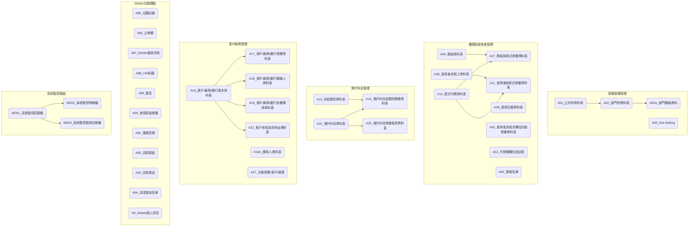

# ARTHGUI 基礎系統資料表總覽

## 系統介紹

ARTHGUI 系統是一個基礎架構系統，主要負責處理系統共用資料及基礎設定相關業務，包括公司部門管理、使用者授權、客戶廠商資料管理、會計科目管理等功能。系統包含多個資料表來記錄系統共用資訊及基礎設定資料，可供其他系統模組參照使用。

## 資料表列表

| No. | 資料表代碼                       | 中文名稱                                  | 主要功能                       |
| --- | --------------------------- | ------------------------------------- | -------------------------- |
| 1   | [A01](ARTHGUI/A01.md)       | 公司別資料表                                | 記錄公司基本資料(Trigger 串.Net)    |
| 2   | [A02](ARTHGUI/A02.md)       | 部門別資料表                                | 記錄部門基本資料(Trigger 串.Net)    |
| 3   | [A02A](ARTHGUI/A02A.md)     | 部門層級資料                                | 管理部門間層級關係(Trigger 串.Net)   |
| 4   | [A03](ARTHGUI/A03.md)       | 傳票類別資料表                               | 設定傳票類別資訊                   |
| 5   | [A04](ARTHGUI/A04.md)       | 傳票自動給號控制表                             | 控制傳票自動編號設定                 |
| 6   | [A05](ARTHGUI/A05.md)       | 常用摘要資料表                               | 記錄常用摘要設定                   |
| 7   | [A06](ARTHGUI/A06.md)       | 群組資料表                                 | 管理使用者群組權限(Trigger 串.Net)   |
| 8   | [A07](ARTHGUI/A07.md)       | 群組與程式授權資料表                            | 設定群組程式授權關係(Trigger 串.Net)  |
| 9   | [A08](ARTHGUI/A08.md)       | 使用者或員工資料表                             | 記錄使用者基本資料(Trigger 串.Net)   |
| 10  | [A09](ARTHGUI/A09.md)       | 使用記錄資料表                               | 記錄系統使用歷程                   |
| 11  | [A10](ARTHGUI/A10.md)       | 程式代碼資料表                               | 管理系統程式代碼                   |
| 12  | [A10E](ARTHGUI/A10E.md)     | 程式代碼資料表(英文)                           | Menu 中英切換使用                |
| 13  | [A11](ARTHGUI/A11.md)       | 使用者與程式授權資料表                           | 設定使用者程式權限(Trigger 串.Net)   |
| 14  | [A12](ARTHGUI/A12.md)       | 系統名稱資料表                               | 記錄系統基本資訊                   |
| 15  | [A13](ARTHGUI/A13.md)       | 科目類別資料表                               | 管理會計科目類別                   |
| 16  | [A14](ARTHGUI/A14.md)       | 會計科目與類別歸屬資料表                          | 設定科目與類別關係                  |
| 17  | [A15](ARTHGUI/A15.md)       | 會計科目資料表                               | 記錄會計科目基本資料                 |
| 18  | [A16](ARTHGUI/A16.md)       | 客戶/廠商/銀行基本資料表                         | 記錄客戶廠商資料(Trigger 串.Net)    |
| 19  | [A16A](ARTHGUI/A16A.md)     | 關係人資料表                                | 管理關係人資訊                    |
| 20  | [A17](ARTHGUI/A17.md)       | 客戶/廠商/銀行授權資料表                         | 設定客戶廠商權限                   |
| 21  | [A18](ARTHGUI/A18.md)       | 客戶/廠商/銀行聯絡人資料表                        | 記錄聯絡人資訊                    |
| 22  | [A19](ARTHGUI/A19.md)       | 客戶/廠商/銀行從屬關係資料表                       | 管理客戶廠商關聯性                  |
| 23  | [A20](ARTHGUI/A20.md)       | 會計科目授權使用資料表                           | 設定科目使用權限                   |
| 24  | [A21](ARTHGUI/A21.md)       | 客戶常用送貨地址資料表                           | 記錄客戶送貨地址                   |
| 25  | [A22](ARTHGUI/A22.md)       | 運送方式與地區代碼資料表                          | 設定運送方式與地區                  |
| 26  | [A23](ARTHGUI/A23.md)       | 產品類別資料表                               | 管理產品分類資訊                   |
| 27  | [A27](ARTHGUI/A27.md)       | Write-Off Table                       | 記錄沖銷資訊(ArthGL)             |
| 28  | [A28](ARTHGUI/A28.md)       | 專案基本資料表                               | 管理專案基本資料                   |
| 29  | [A30](ARTHGUI/A30.md)       | Check Print Definition Table          | 支票列印定義(ArthGL)             |
| 30  | [A31](ARTHGUI/A31.md)       | 每日匯率資料表                               | 記錄匯率變動資訊                   |
| 31  | [A38](ARTHGUI/A38.md)       | Finance Report Authorization Table    | 財務報表授權設定(ArthGL)           |
| 32  | [A39](ARTHGUI/A39.md)       | Report Specification Definition Table | 報表規格定義(ArthGL)             |
| 33  | [A40](ARTHGUI/A40.md)       | Report data Calculation Formula Table | 報表計算公式(ArthGL)             |
| 34  | [A41](ARTHGUI/A41.md)       | 基本代碼資料表                               | 記錄系統基本代碼                   |
| 35  | [A44](ARTHGUI/A44.md)       | 年度週曆設定                                | 管理年度週曆資訊(ArthGL)           |
| 36  | [A45](ARTHGUI/A45.md)       | ZIP Code                              | 記錄郵遞區號資訊                   |
| 37  | [A46](ARTHGUI/A46.md)       | 發票套表設定檔                               | 管理租賃發票套表                   |
| 38  | [A47](ARTHGUI/A47.md)       | 功能授權(客戶/廠商)                           | 設定客戶廠商功能權限                 |
| 39  | [A49](ARTHGUI/A49.md)       | 傳票明細摘要格式表                             | 設定傳票摘要格式(ArthGL)           |
| 40  | [A51](ARTHGUI/A51.md)       | 傳票明細摘要類別設定檔                           | 管理傳票摘要類別(ArthAS)           |
| 41  | [A52](ARTHGUI/A52.md)       | 使用者與程式欄位功能授權資料表                       | 設定欄位權限(Trigger 串.Net)      |
| 42  | [A53](ARTHGUI/A53.md)       | 可授權欄位設定表                              | 記錄可授權欄位資訊                  |
| 43  | [A54](ARTHGUI/A54.md)       | 營運項目代碼表                               | 管理營運項目代碼                   |
| 44  | [A55](ARTHGUI/A55.md)       | 營運資料表                                 | 記錄營運相關資訊                   |
| 45  | [A62](ARTHGUI/A62.md)       | 群組名單                                  | 管理使用者群組列表                  |
| 46  | [A72](ARTHGUI/A72.md)       | 資料鎖控記錄                                | 管理 Record Lock 功能          |
| 47  | [A79](ARTHGUI/A79.md)       | 附件檔                                   | 目前僅 GL 電子簽核用               |
| 48  | [A80](ARTHGUI/A80.md)       | 收款記錄                                  | .NET 門店進銷存系統使用             |
| 49  | [A81](ARTHGUI/A81.md)       | 報表派送設定                                | 管理報表派送設定                   |
| 50  | [A81A](ARTHGUI/A81A.md)     | 報表派送收件人設定                             | 設定報表收件人                    |
| 51  | [A84](ARTHGUI/A84.md)       | Sini-Setting                          | 各系統 Sini 設定                |
| 52  | [A85](ARTHGUI/A85.md)       | 位置紀錄                                  | 記錄 Mobile 位置資訊             |
| 53  | [A86](ARTHGUI/A86.md)       | 公佈欄                                   | Mobile 系統公告管理              |
| 54  | [A87](ARTHGUI/A87.md)       | Mobile 簽核流程                           | 管理 Mobile 簽核流程             |
| 55  | [A88](ARTHGUI/A88.md)       | UID 紀錄                                | 記錄 Mobile 使用者 ID           |
| 56  | [A89](ARTHGUI/A89.md)       | 簽呈                                    | 管理 Mobile 簽呈資訊             |
| 57  | [A90](ARTHGUI/A90.md)       | 會員頁面推播                                | 設定推播訊息功能                   |
| 58  | [A91](ARTHGUI/A91.md)       | 郵遞區號                                  | 記錄 Mobile 郵遞區號             |
| 59  | [A92](ARTHGUI/A92.md)       | 訊息模板                                  | 設定 Mobile 訊息樣板             |
| 60  | [A93](ARTHGUI/A93.md)       | 訊息發送                                  | 記錄訊息發送資訊                   |
| 61  | [A94](ARTHGUI/A94.md)       | 訊息發送名單                                | 管理訊息發送對象                   |
| 62  | [D5](ARTHGUI/D5.md)         | Mobile 個人訊息                           | 管理 Mobile 個人訊息             |
| 63  | [B01](ARTHGUI/B01.md)       | 單據編號設定檔                               | 管理單據編號設定(ArthIV)           |
| 64  | [B02](ARTHGUI/B02.md)       | 單據序號檔                                 | 記錄單據序號資訊(ArthIV)           |
| 65  | [B03](ARTHGUI/B03.md)       | 海關關稅檔                                 | 設定海關關稅資料(ArthIV)           |
| 66  | [B13](ARTHGUI/B13.md)       | 倉庫代碼檔                                 | 管理倉庫基本資訊(ArthIV)           |
| 67  | [B18](ARTHGUI/B18.md)       | 價格管理檔                                 | 記錄價格管理資訊(ArthIV)           |
| 68  | [B19](ARTHGUI/B19.md)       | 單位換算檔                                 | 設定單位換算關係(ArthIV)           |
| 69  | [B20](ARTHGUI/B20.md)       | 拋轉設定檔                                 | 管理資料拋轉設定(ArthIV)           |
| 70  | [B30](ARTHGUI/B30.md)       | 異動原因檔                                 | 記錄異動原因資訊(ArthIV)           |
| 71  | [B33](ARTHGUI/B33.md)       | 盤點主檔                                  | 管理庫存盤點資訊(ArthIV)           |
| 72  | [B83](ARTHGUI/B83.md)       | 電子發票前後台設定來源檔                          | eInSetSyn.exe 使用           |
| 73  | [B84](ARTHGUI/B84.md)       | 字軌檔                                   | 管理發票字軌資訊                   |
| 74  | [C01](ARTHGUI/C01.md)       | 客戶/廠商屬性檔                              | 記錄租賃系統屬性                   |
| 75  | [DS](ARTHGUI/DS.md)         | 資料同步指示檔                               | 管理資料同步設定                   |
| 76  | [DSL](ARTHGUI/DSL.md)       | 資料同步指示異動記錄檔                           | 記錄同步設定變更                   |
| 77  | [GuiQuene](ARTHGUI/GQ.md)   | 單據列印指示檔                               | GUIQuene-MTRGQ.ex 吉比用      |
| 78  | [LB13](ARTHGUI/LB.md)       | 各類資料客戶自訂檔                             | 管理客戶自訂資訊                   |
| 79  | N03                         | 表單基本資料                                | 記錄表單基本設定                   |
| 80  | N04                         | 表單題目                                  | 管理表單題目設定                   |
| 81  | N05                         | 表單回答項目                                | 記錄表單回答選項                   |
| 82  | N35                         | 表單填寫紀錄                                | 記錄表單填寫資訊                   |
| 83  | N36                         | 表單填寫紀錄明細                              | 記錄表單填寫詳情                   |
| 84  | [NDS](ARTHGUI/NDS.md)       | 資料不同步指示檔                              | 管理資料不同步設定                  |
| 85  | [PT01](ARTHGUI/PT01.md)     | 設定活動套表列印格式檔                           | 設定列印格式                     |
| 86  | [PT02](ARTHGUI/PT02.md)     | 設定活動套表列印位置檔                           | 設定列印位置                     |
| 87  | [SA](ARTHGUI/SA.md)         | 銷售分析統計方式設定檔                           | 設定分析方式(ArthIV)             |
| 88  | [SB](ARTHGUI/SB.md)         | 銷售分析統計主檔                              | 記錄銷售分析資料(ArthIV)           |
| 89  | [SINI](ARTHGUI/SINI.md)     | 系統參數設定資料表                             | 系統參數設定(Trigger 串.Net 部份資料) |
| 90  | [TBLDCT](ARTHGUI/TBLDCT.md) | 欄位辭庫                                  | 管理欄位說明資訊                   |
| 91  | [TBLDEF](ARTHGUI/TBLDEF.md) | 資料表格定義                                | 記錄資料表定義                    |
| 92  | [TBLIDX](ARTHGUI/TBLIDX.md) | 資料索引定義                                | 設定資料索引資訊                   |
| 93  | WD01                        | 自動警示功能設定                              | 管理系統警示設定                   |
| 94  | WD02                        | 自動警示功能記錄                              | 記錄系統警示資訊                   |
| 95  | WD03                        | 自動警示功能條件                              | 設定系統警示條件                   |
| 96  | WD04                        | 自動警示功能對象                              | 設定系統警示對象                   |
| 97  | [MD01](ARTHGUI/MD01.md)     | 系統監控記錄檔                               | 記錄系統監控基本資訊                 |
| 98  | [MD02](ARTHGUI/MD02.md)     | 系統監控明細檔                               | 記錄系統監控詳細資訊                 |
| 99  | [MD03](ARTHGUI/MD03.md)     | 系統監控錯誤記錄檔                             | 記錄系統監控過程中發生的錯誤訊息           |

## 資料表關聯圖

## 系統架構

### 模組結構

ARTHGUI 系統由以下主要功能模組組成：

#### 1. 基礎架構管理模組

主要負責系統基礎資料的維護與管理。

- 核心表格：A01(公司別資料表)、A02(部門別資料表)、A84(Sini-Setting)
- 主要功能：
  - 公司資料維護
  - 部門資料管理
  - 系統參數設定
  - 系統基本代碼管理
- 業務流程：
  - 公司新增流程：基本資料輸入 → 參數設定 → 相關設定確認 → 啟用
  - 部門管理流程：部門建立 → 設定部門層級 → 授權設定 → 啟用

#### 2. 權限與使用者管理模組

主要負責系統使用者和權限的管理。

- 核心表格：A06(群組資料表)、A08(使用者或員工資料表)、A10(程式代碼資料表)、A11(使用者與程式授權資料表)
- 主要功能：
  - 使用者管理
  - 群組權限設定
  - 程式授權管理
  - 使用記錄追蹤
- 業務流程：
  - 使用者建立流程：基本資料輸入 → 群組指派 → 權限設定 → 啟用
  - 權限設定流程：建立群組 → 設定程式權限 → 指派使用者 → 權限生效

#### 3. 會計科目管理模組

主要負責會計科目基礎資料的管理。

- 核心表格：A13(科目類別資料表)、A15(會計科目資料表)、A14(會計科目與類別歸屬資料表)
- 主要功能：
  - 會計科目維護
  - 科目類別管理
  - 科目權限設定
- 業務流程：
  - 科目建立流程：基本資料建立 → 類別歸屬設定 → 權限設定 → 啟用

#### 4. 客戶廠商管理模組

主要負責客戶和廠商基礎資料的管理。

- 核心表格：A16(客戶/廠商/銀行基本資料表)、A18(客戶/廠商/銀行聯絡人資料表)、A21(客戶常用送貨地址資料表)
- 主要功能：
  - 客戶資料維護
  - 廠商資料管理
  - 銀行資料管理
  - 聯絡人管理
- 業務流程：
  - 客戶資料維護流程：基本資料輸入 → 聯絡人設定 → 地址設定 → 權限設定 → 啟用

#### 5. Mobile 功能模組

主要負責行動設備相關功能的管理。

- 核心表格：A86(公佈欄)、A87(Mobile 簽核流程)、A92(訊息模板)
- 主要功能：
  - 公佈欄管理
  - 簽核流程設定
  - 訊息發送管理
  - 位置記錄功能
- 業務流程：
  - 訊息發送流程：建立訊息模板 → 設定發送對象 → 排程設定 → 發送訊息

#### 6. 系統監控模組

主要負責系統運行監控和錯誤追蹤的管理。

- 核心表格：MD01(系統監控記錄檔)、MD02(系統監控明細檔)、MD03(系統監控錯誤記錄檔)
- 主要功能：
  - 系統運行狀態監控
  - 錯誤診斷和追蹤
  - 系統效能分析
  - 監控記錄管理
- 業務流程：
  - 監控記錄流程：產生監控記錄 → 記錄處理明細 → 判斷是否有錯誤 → 記錄錯誤訊息
  - 錯誤診斷流程：查詢錯誤記錄 → 分析錯誤原因 → 實施修正措施 → 追蹤解決結果

### 模組關聯與資料表關聯說明

#### 模組間主要關聯

- **基礎架構管理與權限管理**：公司部門資料(A01/A02)是使用者和權限管理的基礎
- **權限管理與客戶廠商管理**：使用者權限(A11)控制對客戶廠商資料的訪問和操作權限
- **基礎架構與會計科目管理**：公司資料(A01)與會計科目(A15)相關聯，不同公司可有不同科目設定
- **基礎架構與 Mobile 功能**：系統基礎設定為 Mobile 功能提供必要參數和配置

#### 重要表格間關聯

1. **A06(群組資料表)與 A07(群組與程式授權資料表)的關聯**

   - **關聯欄位**:
     - A06.群組代碼 → A07.群組代碼
   - **業務關係**:
     - 記錄每個使用者群組可以使用的系統功能
     - 當群組權限變動時，所有屬於該群組的使用者權限都會同步更新

2. **A16(客戶/廠商/銀行基本資料表)與其相關表格的關聯**

   - **關聯欄位**:
     - A16.客戶/廠商代碼 → A18.客戶/廠商代碼
     - A16.客戶/廠商代碼 → A21.客戶/廠商代碼
   - **業務關係**:
     - 記錄客戶/廠商的聯絡人和送貨地址等相關資訊
     - 當基本資料變更時，需同步維護相關表格資料

#### 資料流動路徑

1. **使用者授權資料流**：

   - A08(使用者資料) → A11(使用者權限) → A09(使用記錄)

2. **客戶資料管理資料流**：

   - A16(客戶基本資料) → A18(聯絡人資料) → A21(送貨地址) → A47(功能授權)

## 版本歷史記錄

| 版本 | 日期       | 修改人     | 變更描述     |
| ---- | ---------- | ---------- | ------------ |
| 1.0  | 2023-11-15 | 系統管理員 | 初始版本建立 |
