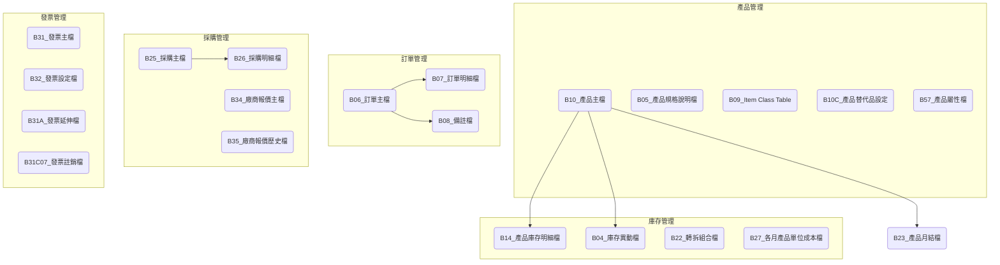

# ARTHIV 進銷存系統資料表總覽

## 系統介紹

ARTHIV 進銷存系統是一個完整的庫存與訂單管理系統，主要負責處理商品庫存、採購、銷售相關業務，包括庫存管理、訂單處理、採購管理、發票管理等功能。系統包含多個資料表來記錄產品、庫存、訂單及相關業務資訊。

## 資料表列表

| No. | 資料表代碼       | 中文名稱                                  | 主要功能                         |
| --- | ---------------- | ----------------------------------------- | -------------------------------- |
| 1   | [B04](ARTHIV/B04.md)    | 庫存異動檔(EXF)                           | 記錄所有庫存變動的明細資料       |
| 2   | [B05](ARTHIV/B05.md)    | 產品規格說明檔(ID)                        | 儲存產品規格詳細資訊             |
| 3   | [B06](ARTHIV/B06.md)    | 訂單主檔(IE)                              | 記錄訂單基本資訊                 |
| 4   | [B07](ARTHIV/B07.md)    | 訂單明細檔(IF)                            | 儲存訂單明細項目資訊             |
| 5   | [B08](ARTHIV/B08.md)    | 備註檔(II)                                | 儲存各種單據的備註資訊           |
| 6   | [B08A](ARTHIV/B08A.md)  | 備註檔(新版)                              | Net 聯合請購使用的備註資訊       |
| 7   | [B09](ARTHIV/B09.md)    | Item Class Table                          | Trigger 串.Net 使用              |
| 8   | [B10](ARTHIV/B10.md)    | 產品主檔(IM)                              | 儲存產品基本資料(Trigger 串.Net) |
| 9   | [B10B](ARTHIV/B10B.md)  | 產品結算異動成本 By 成本中心              | 記錄產品成本變動資訊             |
| 10  | [B10C](ARTHIV/B10C.md)  | 產品替代品設定                            | 設定產品替代品關係               |
| 11  | [B11](ARTHIV/B11.md)    | 費用檔(IO)                                | 記錄系統相關費用資訊             |
| 12  | [B12](ARTHIV/B12.md)    | Current Price                             | 儲存當前產品價格資訊             |
| 13  | [B14](ARTHIV/B14.md)    | 產品庫存明細檔(IW)                        | 記錄產品庫存明細資訊             |
| 14  | [B15](ARTHIV/B15.md)    | 客戶報價主檔(QA)                          | 儲存客戶報價基本資訊             |
| 15  | [B16](ARTHIV/B16.md)    | 客戶報價明細檔(QB)                        | 記錄客戶報價明細資訊             |
| 16  | [B17](ARTHIV/B17.md)    | 歷史檔                                    | 儲存歷史交易記錄                 |
| 17  | [B21](ARTHIV/B21.md)    | 寄售/寄庫檔(I1)                           | 管理寄售和寄庫資訊               |
| 18  | [B22](ARTHIV/B22.md)    | 轉拆組合檔(I2)                            | 處理產品組合和拆解資訊           |
| 19  | [B23](ARTHIV/B23.md)    | 產品月結檔(IA,IB)                         | 記錄產品月結資訊                 |
| 20  | [B24](ARTHIV/B24.md)    | History Price                             | 儲存歷史價格記錄                 |
| 21  | [B25](ARTHIV/B25.md)    | 採購主檔(IG)                              | 記錄採購單基本資訊               |
| 22  | [B26](ARTHIV/B26.md)    | 採購明細檔(IH)                            | 儲存採購單明細資訊               |
| 23  | [B27](ARTHIV/B27.md)    | 各月產品單位成本檔                        | 記錄各月產品成本資訊             |
| 24  | [B31](ARTHIV/B31.md)    | 發票主檔(IT)                              | 管理發票基本資訊                 |
| 25  | [B31A](ARTHIV/B31A.md)  | 發票延伸檔                                | Turnkey 回傳相關資訊             |
| 26  | [B31C07](ARTHIV/B31C07.md) | 發票註銷檔                                | 記錄已註銷的發票資訊             |
| 27  | [B31T08](ARTHIV/B31T08.md) | 發票之固定資產退稅清單資料檔              | 管理發票退稅相關資訊             |
| 28  | [B32](ARTHIV/B32.md)    | 發票設定檔(IV)                            | 儲存發票配置資訊                 |
| 29  | [B34](ARTHIV/B34.md)    | 廠商報價主檔(QC)                          | 管理廠商報價資訊                 |
| 30  | [B35](ARTHIV/B35.md)    | 廠商報價歷史檔(QD)                        | 記錄廠商報價歷史                 |
| 31  | [B36](ARTHIV/B36.md)    | General Remark                            | 通用備註資訊                     |
| 32  | [B37](ARTHIV/B37.md)    | Resource Price Data                       | 資源價格資料                     |
| 33  | [B38](ARTHIV/B38.md)    | Export Invoice                            | 出口發票資訊                     |
| 34  | [B39](ARTHIV/B39.md)    | Invoice Item                              | 發票項目明細                     |
| 35  | [B40](ARTHIV/B40.md)    | Packing Data                              | 包裝資料                         |
| 36  | [B41](ARTHIV/B41.md)    | L/C Data and Amend Log(I3)                | 信用狀資料與修改記錄             |
| 37  | [B42](ARTHIV/B42.md)    | L/C Allocation to S/C(I4)                 | 信用狀分配資訊                   |
| 38  | [B43](ARTHIV/B43.md)    | L/C Nego. Log(I5)                         | 信用狀協商記錄                   |
| 39  | [B44](ARTHIV/B44.md)    | Collection Master(I6)                     | 收款主檔                         |
| 40  | [B45](ARTHIV/B45.md)    | Collection Receive Log(I7)                | 收款接收記錄                     |
| 41  | [B46](ARTHIV/B46.md)    | Duty Table(I8)                            | 關稅表                           |
| 42  | [B47](ARTHIV/B47.md)    | Department Purchase Setting               | 部門採購設定                     |
| 43  | [B47A](ARTHIV/B47A.md)  | 常用生產品項清單                          | 記錄常用產品項目                 |
| 44  | [B48](ARTHIV/B48.md)    | Department Purchase Daily Request         | 部門每日採購請求                 |
| 45  | [B48Temp](ARTHIV/B48Temp.md) | Department Purchase Daily Request For Web | 網頁版部門採購請求               |
| 46  | [B49](ARTHIV/B49.md)    | Packing                                   | 包裝資訊                         |
| 47  | [B50](ARTHIV/B50.md)    | Packing                                   | 包裝資訊                         |
| 48  | [B51](ARTHIV/B51.md)    | 廠商報價檔                                | 記錄廠商報價資訊                 |
| 49  | [B51A](ARTHIV/B51A.md)  | 標單循環日期設定                          | 標單循環日期管理                 |
| 50  | [B52](ARTHIV/B52.md)    | 領用/領退分錄設定                         | 設定領用與退回                   |
| 51  | [B53](ARTHIV/B53.md)    | 產品基本資料分類檔                        | 產品分類管理                     |
| 52  | [B54](ARTHIV/B54.md)    | 產品基本資料待審檔                        | 儲存待審核產品資料               |
| 53  | [B55](ARTHIV/B55.md)    | 產品基本資料紀錄檔                        | 記錄產品基本資料變更             |
| 54  | [B56](ARTHIV/B56.md)    | 特種發票檔                                | 管理特種發票資訊                 |
| 55  | [B57](ARTHIV/B57.md)    | 產品屬性檔                                | 記錄產品屬性資訊                 |
| 56  | [B58](ARTHIV/B58.md)    | 嘜頭主檔                                  | 管理貨運標記主要資訊             |
| 57  | [B59](ARTHIV/B59.md)    | 嘜頭內容檔                                | 記錄貨運標記詳細內容             |
| 58  | [B60](ARTHIV/B60.md)    | 客戶/單據嘜頭檔                           | 管理客戶與單據的貨運標記         |
| 59  | [B61](ARTHIV/B61.md)    | Buyer Warehouse                           | 買方倉庫資訊                     |
| 60  | [B62](ARTHIV/B62.md)    | 併櫃資料暫存檔                            | 暫存合併集裝箱資料               |
| 61  | [B63](ARTHIV/B63.md)    | 產品定期交貨排程檔                        | 管理產品定期交貨排程             |
| 62  | [B64](ARTHIV/B64.md)    | 營業稅額調整計算檔                        | 計算營業稅額調整                 |
| 63  | [B65](ARTHIV/B65.md)    | Exp ID 檔                                 | 出口識別資訊                     |
| 64  | [B66](ARTHIV/B66.md)    | 套餐菜單成本預估檔                        | 預估套餐成本                     |
| 65  | [B70](ARTHIV/B70.md)    | 發票獎別設定                              | 設定發票獎別                     |
| 66  | [B71](ARTHIV/B71.md)    | 組合主件工時                              | 記錄組合產品主件工時             |
| 67  | [B71A](ARTHIV/B71A.md)  | 組合單攤提費用                            | 管理組合單費用攤提               |
| 68  | [B72](ARTHIV/B72.md)    | 分攤費用設定                              | 設定費用分攤方式                 |
| 69  | [B73](ARTHIV/B73.md)    | 成本中心設定                              | 設定成本中心資訊                 |
| 70  | [B74](ARTHIV/B74.md)    | 部門發票申報資料檔                        | 依部門別申報的發票資料           |
| 71  | [B75](ARTHIV/B75.md)    | 部門會科對應設定檔                        | 設定部門與會計科目對應           |
| 72  | [B76](ARTHIV/B76.md)    | 部門每日請購常用清單配送方式檔            | 設定部門請購清單配送方式         |
| 73  | [B76A](ARTHIV/B76A.md)  | 各庫調撥及領用品項設定檔                  | Net 聯合請購使用                 |
| 74  | [B77](ARTHIV/B77.md)    | 門市可查庫別設定檔                        | 設定門市可查看的庫存             |
| 75  | [B78](ARTHIV/B78.md)    | 百貨發票開立紀錄檔                        | 記錄百貨發票開立資訊             |
| 76  | [B79](ARTHIV/B79.md)    | 各機構發票格式及張數設定                  | IVM87.exe 使用                   |
| 77  | [B80](ARTHIV/B80.md)    | 總/分支機構發票配號檔                     | IVP51.exe 使用                   |
| 78  | B81        | 品項與商品分類                            | BCM41.exe-手機報表使用           |
| 79  | B82        | 變價歷史檔案                              | BCM42.exe-手機報表使用           |
| 80  | [C2](ARTHIV/C2.md)      | 產品單位成本檔                            | 記錄產品單位成本資訊             |
| 81  | [NDS](ARTHIV/NDS.md)    | 資料不同步指示檔                          | 管理資料同步狀態                 |
| 82  | [SINI](ARTHIV/SINI.md)  | System Property                           | 系統屬性設定                     |
| 83  | [M01](ARTHIV/M01.md)    | 製造工令                                  | 管理製造工令資訊                 |
| 84  | [M02](ARTHIV/M02.md)    | 銷售預估                                  | 記錄銷售預估資料                 |

## 資料表關聯圖

## 系統架構

### 模組結構

ARTHIV 系統由以下主要功能模組組成：

#### 1. 產品管理模組

主要負責產品資料的維護與管理。

- 核心表格：B10(產品主檔)、B05(產品規格說明檔)、B57(產品屬性檔)
- 主要功能：
  - 產品基本資料維護
  - 產品規格管理
  - 產品屬性設定
  - 產品替代品關係管理
- 業務流程：
  - 產品新增流程：基本資料輸入 → 屬性設定 → 規格確認 → 審核 → 啟用
  - 產品變更流程：提出變更申請 → 修改資料 → 審核 → 更新生效

#### 2. 庫存管理模組

主要負責產品庫存的追蹤與管理。

- 核心表格：B04(庫存異動檔)、B14(產品庫存明細檔)、B22(轉拆組合檔)
- 主要功能：
  - 庫存異動追蹤
  - 庫存查詢與報表
  - 產品組合與拆解管理
  - 庫存盤點功能
- 業務流程：
  - 入庫流程：採購到貨 → 品質檢驗 → 入庫作業 → 庫存更新
  - 出庫流程：訂單確認 → 撿貨作業 → 出庫作業 → 庫存更新

#### 3. 訂單管理模組

主要負責銷售訂單的處理。

- 核心表格：B06(訂單主檔)、B07(訂單明細檔)、B08(備註檔)
- 主要功能：
  - 銷售訂單建立與維護
  - 訂單處理與追蹤
  - 訂單審核與確認
- 業務流程：
  - 訂單處理流程：訂單錄入 → 庫存確認 → 訂單確認 → 出貨準備 → 發票開立

#### 4. 採購管理模組

主要負責採購作業的處理。

- 核心表格：B25(採購主檔)、B26(採購明細檔)、B34(廠商報價主檔)
- 主要功能：
  - 採購單建立與維護
  - 採購審核與確認
  - 廠商報價管理
- 業務流程：
  - 採購流程：請購單建立 → 採購單建立 → 採購審核 → 訂單發出 → 收貨確認

#### 5. 發票管理模組

主要負責發票開立與管理。

- 核心表格：B31(發票主檔)、B32(發票設定檔)
- 主要功能：
  - 發票開立與列印
  - 發票查詢與追蹤
  - 發票作廢處理
- 業務流程：
  - 發票開立流程：出貨確認 → 發票資料確認 → 發票開立 → 發票列印

### 模組關聯與資料表關聯說明

#### 模組間主要關聯

- **產品管理與庫存管理**：產品主檔(B10)提供產品資訊給庫存模組使用
- **採購管理與庫存管理**：採購入庫會更新庫存異動檔(B04)和產品庫存明細檔(B14)
- **訂單管理與庫存管理**：訂單處理過程中需要檢查和更新庫存資訊
- **訂單管理與發票管理**：訂單出貨完成後觸發發票開立程序

#### 重要表格間關聯

1. **B10(產品主檔)與 B14(產品庫存明細檔)的關聯**

   - **關聯欄位**:
     - B10.產品代碼 → B14.產品代碼
   - **業務關係**:
     - 記錄每個產品在各倉庫的庫存數量
     - 當產品有庫存異動時，會更新相關庫存記錄

2. **B06(訂單主檔)與 B07(訂單明細檔)的關聯**

   - **關聯欄位**:
     - B06.訂單編號 → B07.訂單編號
   - **業務關係**:
     - 訂單主檔記錄客戶與訂單相關資訊
     - 訂單明細檔記錄訂單中的產品項目與數量

#### 資料流動路徑

1. **銷售訂單處理資料流**：

   - B06/B07(訂單資料) → B04(庫存異動) → B14(庫存更新) → B31(發票開立)

2. **採購入庫資料流**：

   - B25/B26(採購資料) → B04(庫存異動) → B14(庫存更新) → B27(成本更新)

## 版本歷史記錄

| 版本 | 日期       | 修改人     | 變更描述     |
| ---- | ---------- | ---------- | ------------ |
| 1.0  | 2023-11-15 | 系統管理員 | 初始版本建立 |
