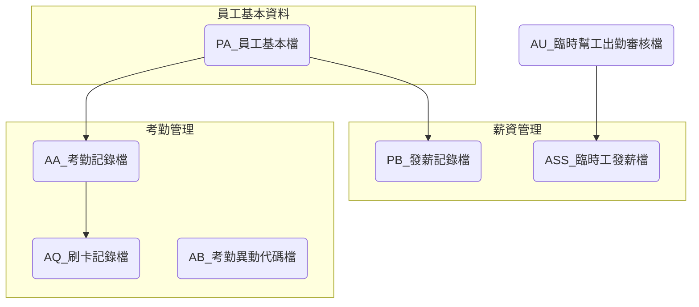

# ARTHPY 系統資料表總覽

## 系統介紹

ARTHPY系統是一個人力資源管理系統，主要負責處理人事與薪資相關業務，包括員工基本資料管理、考勤記錄、薪資計算、勞健保管理等功能。系統包含多個資料表來記錄員工資訊、考勤狀況、薪資發放及相關業務資訊。

## 資料表列表

| No. | 資料表代碼                      | 中文名稱            | 主要功能                       |
| --- | -------------------------- | --------------- | -------------------------- |
| 1   | [AA](ARTHPY/AA.md)         | 考勤記錄檔           | 記錄員工出勤與請假資訊(Trigger串.Net)  |
| 2   | [AB](ARTHPY/AB.md)         | 考勤異動代碼檔         | 定義考勤異動的代碼類型(Trigger串.Net)  |
| 3   | [AC](ARTHPY/AC.md)         | 免稅時數檔           | 記錄免稅時數資訊                   |
| 4   | [AD](ARTHPY/AD.md)         | 加班倍數設定檔         | 設定各類型加班的倍數計算               |
| 5   | [AE](ARTHPY/AE.md)         | 加班費級距檔          | 定義加班費計算的級距規則               |
| 6   | [AF](ARTHPY/AF.md)         | 考勤異動類別檔         | 定義考勤異動類別資訊                 |
| 7   | [AG](ARTHPY/AG.md)         | 年資假期核準天數檔       | 記錄員工年資對應假期核準天數             |
| 8   | [AH](ARTHPY/AH.md)         | 晉昇績點檔           | 記錄員工晉昇績點資訊                 |
| 9   | [AI](ARTHPY/AI.md)         | 部門排班檔           | 記錄部門排班資訊                   |
| 10  | [AJ](ARTHPY/AJ.md)         | 員工班別檔           | 記錄員工班別資訊(for旅館)            |
| 11  | [AK](ARTHPY/AK.md)         | 員工用餐檔           | 記錄員工用餐資訊(for旅館)            |
| 12  | [AL](ARTHPY/AL.md)         | 班別主檔            | 定義班別基本資訊(for旅館)            |
| 13  | [AM](ARTHPY/AM.md)         | 班別津貼檔           | 定義班別津貼規則(for旅館)            |
| 14  | [AN](ARTHPY/AN.md)         | 上下班時間控制檔        | 控制上下班時間規則(for旅館)           |
| 15  | [AO](ARTHPY/AO.md)         | 員工排班檔           | 記錄員工排班資訊(for旅館)            |
| 16  | [AP](ARTHPY/AP.md)         | 員工時薪計算基礎檔       | 記錄員工時薪計算基礎(for旅館)          |
| 17  | [AQ](ARTHPY/AQ.md)         | 刷卡記錄檔           | 記錄員工刷卡時間(for旅館)            |
| 18  | [AR](ARTHPY/AR.md)         | 員工發卡記錄檔         | 記錄員工發卡資訊(for旅館)            |
| 19  | [ASS](ARTHPY/ASS.md)       | 臨時工發薪檔          | 記錄臨時工薪資發放資訊(for旅館)         |
| 20  | [AT](ARTHPY/AT.md)         | 臨時幫工勞退保批次申報記錄檔  | 記錄臨時幫工勞退保批次申報(來源PYP48.exe) |
| 21  | [AU](ARTHPY/AU.md)         | 臨時幫工出勤審核檔       | 臨時幫工出勤審核資訊(來源ABM14.exe)    |
| 22  | [NDS](ARTHPY/NDS.md)       | 資料不同步指示檔案       | 記錄資料同步狀態資訊                 |
| 23  | [P1](ARTHPY/P1.md)         | 勞退工資級距資料        | 記錄勞退工資級距資訊                 |
| 24  | [YP1](ARTHPY/YP1.md)       | 年度勞退工資級距資料      | 記錄年度勞退工資級距資訊               |
| 25  | [P2](ARTHPY/P2.md)         | 勞退金提撥明細資料       | 記錄勞退金提撥明細資訊                |
| 26  | [P3](ARTHPY/P3.md)         | 員工勞退基本資料        | 記錄員工勞退基本資料                 |
| 27  | [P4](ARTHPY/P4.md)         | 職等職務/薪等薪級 薪資檔   | 記錄職等職務與薪等薪級資訊(For 福容)      |
| 28  | [P5](ARTHPY/P5.md)         | 薪等薪級調整檔         | 記錄薪等薪級調整資訊(For 福容)         |
| 29  | [P6](ARTHPY/P6.md)         | 勞保設定            | 定義勞保相關設定                   |
| 30  | [P7](ARTHPY/P7.md)         | 臨時幫工勞退金提撥明細資料   | 記錄臨時幫工勞退金提撥明細              |
| 31  | [P8](ARTHPY/P8.md)         | 留停紀錄            | 記錄員工留停資訊                   |
| 32  | [PA](ARTHPY/PA.md)         | 員工基本檔           | 記錄員工基本資料(Trigger串.Net)     |
| 33  | [PB](ARTHPY/PB.md)         | 發薪記錄檔           | 記錄薪資發放資訊                   |
| 34  | [PC](ARTHPY/PC.md)         | 薪資代碼檔           | 定義薪資代碼                     |
| 35  | [PCA](ARTHPY/PCA.md)       | 特定部門對應薪資代碼之會計科目 | 定義特定部門薪資代碼的會計科目對應          |
| 36  | [PD](ARTHPY/PD.md)         | 所得類別基本資料檔       | 記錄所得類別基本資料                 |
| 37  | [PE](ARTHPY/PE.md)         | 領現名單檔           | 記錄領現員工名單                   |
| 38  | [PF](ARTHPY/PF.md)         | 員工基本支薪檔         | 記錄員工基本支薪資訊                 |
| 39  | [PG](ARTHPY/PG.md)         | 發薪期別設定檔         | 定義發薪期別設定                   |
| 40  | [PH](ARTHPY/PH.md)         | 所得稅標準扣繳檔        | 定義所得稅標準扣繳規則                |
| 41  | [PI](ARTHPY/PI.md)         | 勞保費分攤計費檔        | 記錄勞保費分攤計費資訊                |
| 42  | [PK](ARTHPY/PK.md)         | 人力預估資料          | 記錄人力預估資訊(For 君悅)           |
| 43  | [PKA](ARTHPY/PKA.md)       | 人力預估資料          | 記錄人力預估資訊(For 君悅)           |
| 44  | [PL](ARTHPY/PL.md)         | 職務級距薪資檔         | 定義職務級距薪資                   |
| 45  | [PM](ARTHPY/PM.md)         | 職等職務代碼檔         | 定義職等職務代碼(Trigger串.Net)     |
| 46  | [PN](ARTHPY/PN.md)         | 執行業務代碼檔         | 定義執行業務代碼                   |
| 47  | [PO](ARTHPY/PO.md)         | 銀行局碼檔           | 記錄銀行局碼資訊                   |
| 48  | [PP](ARTHPY/PP.md)         | 員工歸屬薪資等級檔       | 記錄員工歸屬薪資等級(for台勤)          |
| 49  | [PQ](ARTHPY/PQ.md)         | 健保費用分攤檔         | 記錄健保費用分攤資訊                 |
| 50  | [PR](ARTHPY/PR.md)         | 薪資分攤表           | 記錄薪資分攤資訊(for怡和)            |
| 51  | [PS](ARTHPY/PS.md)         | 人事記錄代碼檔         | 定義人事記錄代碼                   |
| 52  | [PT](ARTHPY/PT.md)         | 人事記錄檔           | 記錄人事異動資訊                   |
| 53  | [PU](ARTHPY/PU.md)         | 眷屬名單            | 記錄員工眷屬資訊                   |
| 54  | [PV](ARTHPY/PV.md)         | 人事其他資料檔         | 記錄人事其他資料                   |
| 55  | [PW](ARTHPY/PW.md)         | 人事備註檔           | 記錄人事備註資訊                   |
| 56  | [PX](ARTHPY/PX.md)         | 眷屬健保明細檔         | 記錄眷屬健保明細資訊                 |
| 57  | [PXA](ARTHPY/PXA.md)       | 補充保費明細檔         | 記錄補充保費明細資訊                 |
| 58  | [PY](ARTHPY/PY.md)         | 時薪基本資料          | 記錄時薪基本資料                   |
| 59  | [PZ](ARTHPY/PZ.md)         | 工時登錄            | 記錄工時登錄資訊                   |
| 60  | [SM](ARTHPY/SM.md)         | 日期狀態設定檔         | 定義日期狀態設定                   |
| 61  | [VT01](ARTHPY/VT01.md)     | 公休假設定檔          | 定義公休假設定(可休假天數)             |
| 62  | [WK](ARTHPY/WK.md)         | 加班費工作檔          | 記錄加班費工作資訊                  |
| 63  | [WK01](ARTHPY/WK01.md)     | 年度薪資所得扣繳檔       | 記錄年度薪資所得扣繳資訊               |
| 64  | [WK02](ARTHPY/WK02.md)     | 年度薪資所得彙總檔       | 記錄年度薪資所得彙總資訊               |
| 65  | [WK03](ARTHPY/WK03.md)     | 補充保費申報明細檔       | 記錄補充保費申報明細                 |
| 66  | [SINI](ARTHPY/SINI.md)     | 系統設定檔           | 記錄系統基本設定                   |
| 67  | [YSINI](ARTHPY/YSINI.md)   | 年度系統設定檔         | 記錄年度系統設定                   |
| 68  | [PALog](ARTHPY/PALog.md)   | 員工基本檔異動紀錄       | 記錄員工基本檔異動資訊                |
| 69  | [PFLog](ARTHPY/PFLog.md)   | 員工基本支薪檔異動紀錄     | 記錄員工基本支薪檔異動資訊              |
| 70  | [PTLog](ARTHPY/PTLog.md)   | 人事記錄檔異動紀錄       | 記錄人事記錄檔異動資訊                |
| 71  | [PACTmp](ARTHPY/PACTmp.md) | 報到人員基本檔         | 記錄報到人員基本資料(.NET新人報到系統)     |
| 72  | [PFCTmp](ARTHPY/PFCTmp.md) | 報到人員基本支薪檔       | 記錄報到人員基本支薪資料(.NET新人報到系統)   |
| 73  | [PUCTmp](ARTHPY/PUCTmp.md) | 報到人員親屬名單        | 記錄報到人員親屬資料(.NET新人報到系統)     |

## 資料表關聯圖

## 系統架構

### 模組結構

ARTHPY系統由以下主要功能模組組成：

#### 1. 人事管理模組

主要負責員工基本資料與人事異動的管理。

- 核心表格：PA(員工基本檔)、PT(人事記錄檔)、PU(眷屬名單)
- 主要功能：
  - 員工基本資料維護
  - 人事異動記錄
  - 員工親屬資料管理
  - 新進員工報到處理
- 業務流程：
  - 員工入職流程：建立員工資料→更新PA表基本資料→設定薪資資訊→記錄在PA，同時更新相關薪資設定
  - 人員異動流程：記錄人事異動(如調職、升遷)→更新PA表相關欄位→同步更新PT表記錄異動歷史

#### 2. 考勤管理模組

負責處理員工出勤、休假與刷卡記錄。

- 核心表格：AA(考勤記錄檔)、AB(考勤異動代碼檔)、AQ(刷卡記錄檔)
- 主要功能：
  - 出勤資料記錄與維護
  - 請假資料處理
  - 刷卡資料收集與處理
  - 考勤異常處理

#### 3. 薪資計算模組

處理薪資計算與發放相關業務。

- 核心表格：PB(發薪記錄檔)、PC(薪資代碼檔)、PF(員工基本支薪檔)
- 主要功能：
  - 定期薪資計算
  - 薪資發放處理
  - 薪資調整與追溯
  - 費用分攤計算

#### 4. 臨時工管理模組

專門處理臨時工的出勤與薪資管理。

- 核心表格：AU(臨時幫工出勤審核檔)、ASS(臨時工發薪檔)
- 主要功能：
  - 臨時工出勤審核
  - 臨時工薪資計算
  - 臨時工勞健保管理

#### 5. 勞健保管理模組

負責員工勞健保相關業務處理。

- 核心表格：P1(勞退工資級距資料)、P2(勞退金提撥明細資料)、P3(員工勞退基本資料)
- 主要功能：
  - 勞保申報與管理
  - 健保申報與管理
  - 勞退提撥處理
  - 補充保費計算

#### 6. 系統設定模組

處理系統基本設定與代碼維護。

- 核心表格：SINI(系統設定檔)、YSINI(年度系統設定檔)、SM(日期狀態設定檔)
- 主要功能：
  - 系統基本參數設定
  - 年度參數更新
  - 假日與工作日設定

### 模組關聯與資料表關聯說明

#### 模組間主要關聯

- **人事管理與薪資計算**：共用PA表實現員工基本資料共享
- **考勤管理與薪資計算**：AA表的考勤記錄影響PB表的薪資計算
- **臨時工管理與勞健保管理**：臨時工資料需納入勞健保申報範圍
- **系統設定模組**：影響所有模組的運作邏輯和計算規則

#### 重要表格間關聯

1. **PA與AA的關聯**

   - **關聯欄位**:
     - PA員工編號 → AA員工編號
   - **業務關係**:
     - PA儲存員工基本資料，AA記錄員工考勤資訊
     - 員工考勤異動時，AA進行記錄，並可能影響薪資計算
2. **PA與PB的關聯**

   - **關聯欄位**:
     - PA員工編號 → PB員工編號
   - **業務關係**:
     - PA儲存員工基本資料，PB記錄薪資發放資訊
     - 薪資計算時，根據PA的基本資料與AA的考勤記錄計算薪資
3. **AU與ASS的關聯**

   - **關聯欄位**:
     - AU員工編號 → ASS員工編號
   - **業務關係**:
     - AU記錄臨時幫工出勤審核資訊，ASS記錄臨時工薪資發放資訊
     - 臨時工薪資依據出勤審核結果計算

#### 資料流動路徑

1. **正職員工資料流**：

   - PA(基本資料) → AA(考勤記錄) → PB(薪資發放)
   - PA(基本資料) → P3(勞退基本資料) → P2(勞退提撥)
2. **臨時工資料流**：

   - AU(臨時工出勤) → ASS(臨時工薪資) → AT(勞退保申報)
   - AU(臨時工出勤) → P7(臨時幫工勞退提撥)

## 版本歷史記錄

| 版本 | 日期       | 修改人     | 變更描述                         |
| ---- | ---------- | ---------- | -------------------------------- |
| 1.0  | 2023-06-01 | 系統管理員 | 初始版本建立                     |
| 1.1  | 2023-06-15 | 系統管理員 | 整合資料表列表區塊               |
| 1.2  | 2023-06-16 | 系統管理員 | 更新系統架構，整合資料表關聯說明 |
| 1.3  | 2023-06-17 | 系統管理員 | 整合常見業務流程到模組結構說明中 |
