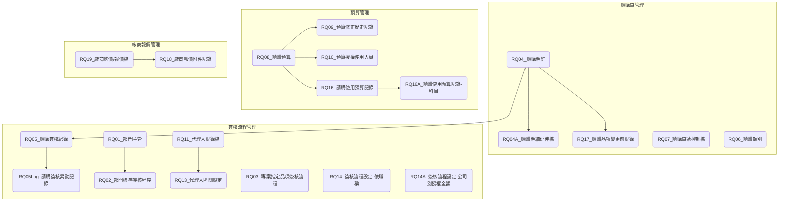

# ARTHRQ 請購系統資料表總覽

## 系統介紹

ARTHRQ請購系統是一個請購流程管理系統，主要負責處理企業內部請購申請與審核相關業務，包括請購單建立、簽核流程設定、預算控管、廠商詢價等功能。系統包含多個資料表來記錄請購單資訊、簽核流程及預算控管等相關資料。

## 資料表列表

| No. | 資料表代碼       | 中文名稱            | 主要功能             |
| --- | ---------------- | --------------- | ---------------- |
| 1   | [RQ01](ARTHRQ/RQ01.md)    | 部門主管            | 記錄各部門主管資訊        |
| 2   | [RQ02](ARTHRQ/RQ02.md)    | 部門標準簽核程序        | 設定部門標準簽核流程       |
| 3   | [RQ03](ARTHRQ/RQ03.md)    | 專案指定品項簽核流程      | 管理專案特定品項的簽核流程    |
| 4   | [RQ04](ARTHRQ/RQ04.md)    | 請購明細            | 記錄請購單明細資訊        |
| 5   | [RQ05](ARTHRQ/RQ05.md)    | 請購簽核紀錄          | 記錄請購單簽核歷程        |
| 6   | [RQ05Log](ARTHRQ/RQ05Log.md) | 請購簽核異動記錄        | 追蹤簽核過程異動紀錄       |
| 7   | [RQ06](ARTHRQ/RQ06.md)    | 請購類別            | 管理請購單類別設定        |
| 8   | [RQ07](ARTHRQ/RQ07.md)    | 請購單號控制檔         | 控制請購單號自動編號       |
| 9   | [RQ08](ARTHRQ/RQ08.md)    | 請購預算            | 管理請購預算資訊         |
| 10  | [RQ09](ARTHRQ/RQ09.md)    | 預算修正歷史記錄        | 記錄預算修改歷史         |
| 11  | [RQ10](ARTHRQ/RQ10.md)    | 預算授權使用人員        | 設定預算使用授權         |
| 12  | [RQ11](ARTHRQ/RQ11.md)    | 代理人記錄檔          | 記錄簽核代理人資訊        |
| 13  | [RQ12](ARTHRQ/RQ12.md)    | 資產撥補指示          | 管理資產撥補相關指令       |
| 14  | [RQ13](ARTHRQ/RQ13.md)    | 代理人區間設定         | 設定代理人有效時間區間      |
| 15  | [RQ04A](ARTHRQ/RQ04A.md)  | 請購明細延伸檔         | 記錄聯合採購擴充資訊       |
| 16  | [RQ14](ARTHRQ/RQ14.md)    | 簽核流程設定-依職稱      | 依職稱設定簽核流程規則      |
| 17  | [RQ14A](ARTHRQ/RQ14A.md)  | 簽核流程設定-公司別授權金額  | 依公司別設定授權金額(暫不使用) |
| 18  | [RQ15](ARTHRQ/RQ15.md)    | 常用請購品項設定        | 設定常用請購品項清單       |
| 19  | [RQ16](ARTHRQ/RQ16.md)    | 請購使用預算記錄(預算書)   | 記錄預算書中的預算使用情況    |
| 20  | [RQ16A](ARTHRQ/RQ16A.md)  | 請購使用預算記錄(科目)    | 記錄科目別的預算使用情況     |
| 21  | [RQ17](ARTHRQ/RQ17.md)    | 請購品項變更前記錄       | 記錄請購品項變更前的資訊     |
| 22  | [RQ18](ARTHRQ/RQ18.md)    | 廠商報價附件記錄        | 管理廠商報價的附件資訊      |
| 23  | [RQ19](ARTHRQ/RQ19.md)    | 廠商詢價/報價檔        | 記錄廠商詢價與報價資料      |
| 24  | SINI    | System Property | 記錄系統屬性設定         |

## 資料表關聯圖

## 系統架構

### 模組結構

ARTHRQ系統由以下主要功能模組組成：

#### 1. 請購單管理模組

主要負責請購單的建立與管理。

- 核心表格：RQ04(請購明細)、RQ06(請購類別)、RQ07(請購單號控制檔)
- 主要功能：
  - 請購單建立與維護
  - 請購類別管理
  - 請購單號管理
  - 常用請購項目設定
- 業務流程：
  - 請購建立流程：選擇類別→填寫請購資訊→設定預算→送出申請→進入簽核流程
  - 請購變更流程：修改請購內容→記錄變更前內容→送出變更申請→重新簽核

#### 2. 簽核流程管理模組

主要負責請購單簽核流程的設定與執行。

- 核心表格：RQ01(部門主管)、RQ02(部門標準簽核程序)、RQ05(請購簽核紀錄)、RQ14(簽核流程設定-依職稱)
- 主要功能：
  - 簽核流程設定
  - 簽核過程記錄
  - 代理人管理
  - 異動記錄追蹤
- 業務流程：
  - 標準簽核流程：部門主管→部門經理→財務主管→總經理
  - 代理人設定流程：指定代理人→設定代理期間→代理權限確認→啟用代理

#### 3. 預算管理模組

主要負責請購預算的控管。

- 核心表格：RQ08(請購預算)、RQ10(預算授權使用人員)、RQ16(請購使用預算記錄)
- 主要功能：
  - 預算設定與管理
  - 預算使用記錄
  - 預算授權管理
  - 預算修正追蹤
- 業務流程：
  - 預算設定流程：預算編列→預算審核→預算核准→預算啟用
  - 預算使用流程：請購申請→預算檢核→預算扣減→預算使用記錄

#### 4. 廠商報價管理模組

主要負責廠商詢價與報價的管理。

- 核心表格：RQ18(廠商報價附件記錄)、RQ19(廠商詢價/報價檔)
- 主要功能：
  - 廠商詢價管理
  - 報價資料記錄
  - 報價附件管理
- 業務流程：
  - 詢價流程：請購單建立→發送詢價→接收報價→報價評估→選擇供應商

### 模組關聯與資料表關聯說明

#### 模組間主要關聯

- **請購單管理與簽核流程管理**：請購單(RQ04)建立後進入簽核流程(RQ05)
- **請購單管理與預算管理**：請購單(RQ04)會檢核並使用預算(RQ16)
- **簽核流程管理與預算管理**：簽核流程中會驗證預算授權(RQ10)
- **請購單管理與廠商報價管理**：請購單可能需要進行廠商詢價(RQ19)

#### 重要表格間關聯

1. **RQ04(請購明細)與RQ05(請購簽核紀錄)的關聯**

   - **關聯欄位**:
     - RQ04.單號 → RQ05.單號
   - **業務關係**:
     - 請購單需經過簽核流程處理
     - 簽核紀錄追蹤請購單處理過程

2. **RQ08(請購預算)與RQ16(請購使用預算記錄)的關聯**

   - **關聯欄位**:
     - RQ08.預算編號 → RQ16.預算編號
   - **業務關係**:
     - 記錄預算的使用情況
     - 控制預算的可用額度

#### 資料流動路徑

1. **請購申請資料流**：
   - RQ04(請購明細) → RQ05(請購簽核紀錄) → RQ16(預算使用記錄)

2. **預算控管資料流**：
   - RQ08(請購預算) → RQ10(預算授權使用人員) → RQ16(預算使用記錄)

## 版本歷史記錄

| 版本 | 日期       | 修改人     | 變更描述                         |
| ---- | ---------- | ---------- | -------------------------------- |
| 1.0  | 2023-11-15 | 系統管理員 | 初始版本建立                     |
